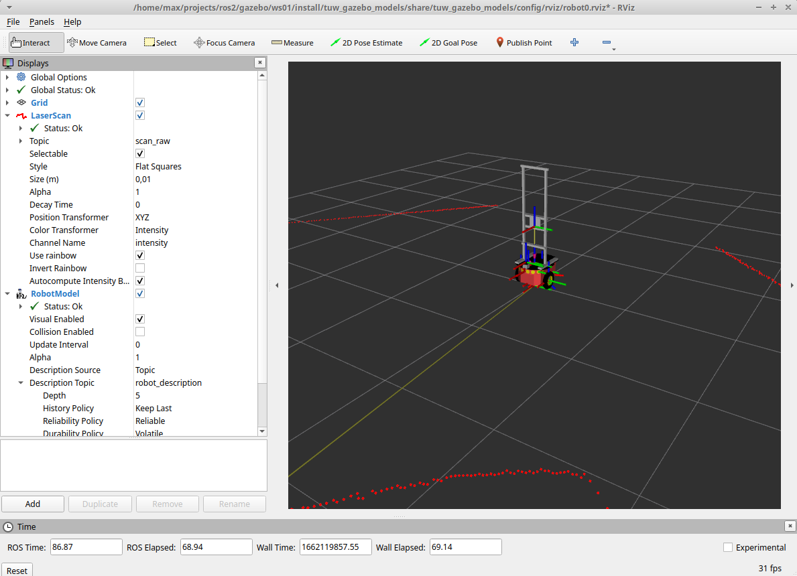
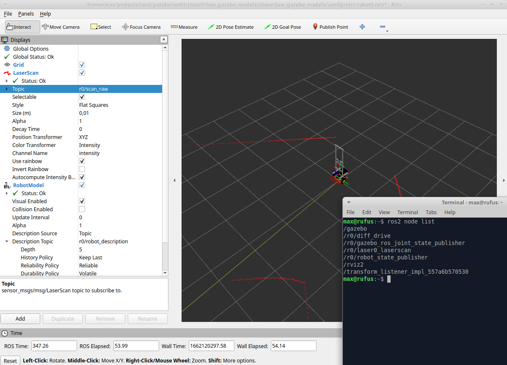
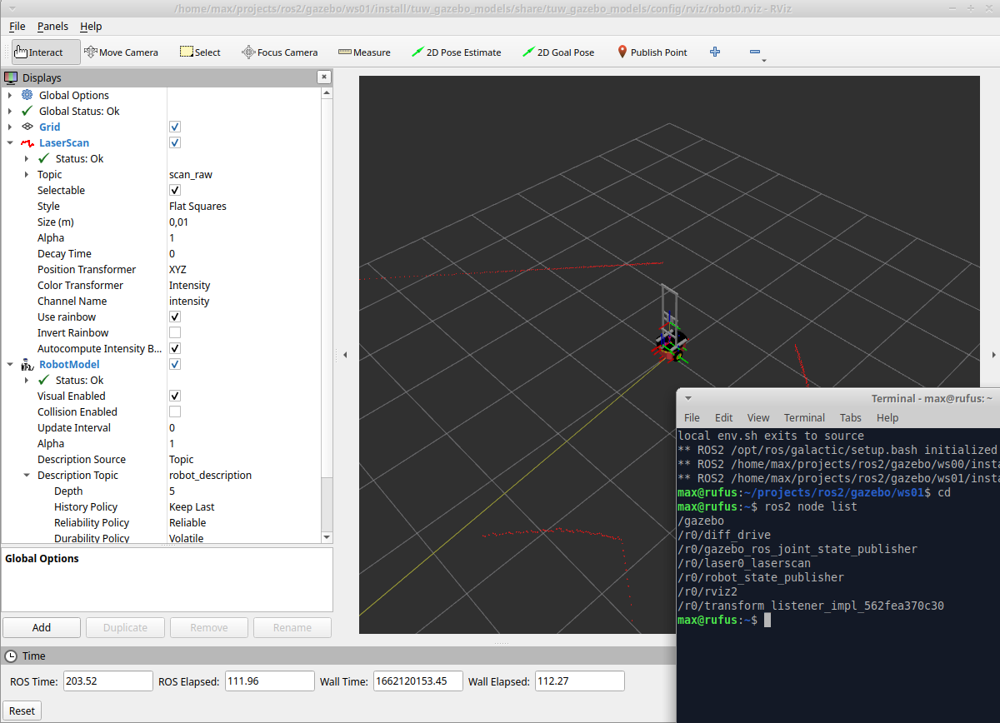

# tuw2_gazebo
gazebo models for ros2

   

## Demo
### Launch World
```
ros2 launch tuw_gazebo world.launch.py room:=cave
```
### Spawn a robot
```
ros2 launch tuw_gazebo_models spawn_robot.launch.py model_name:=robot0 \
                                                    robot:=pioneer3dx \
                                                    X:=-6.0 Y:=-6.0 Theta:=0.7
```
* __model_name__ model name used in gazebo and node prefix
* __robot__ robot type used to load the correct xacro file from your model folder
### RViz2
No additional namespace is set
```
ros2 launch tuw_gazebo_models rviz.launch.py config:=robot0
```


### Wanderer
```
ros2 run tuw_gazebo_wanderer wanderer_v0.py --ros-args --remap cmd:=/r0/cmd_vel --remap scan:=/r0/scan_raw
```
Useful ROS2 service calls to gazebo
```
# delete a Entry/Model
ros2 service call /delete_entity 'gazebo_msgs/DeleteEntity' '{name: "robot0"}'
# list Models
ros2 service call /get_model_list 'gazebo_msgs/srv/GetModelList' 
# reset simulation
ros2 service call /reset_simulation 'std_srvs/srv/Empty'
```
## Multuiple robots and namespaces
### Spawn a robot
We are going to use the  __namespace__ argument set on __r0__
```
ros2 launch tuw_gazebo_models spawn_robot.launch.py namespace:=r0 \
                                                    model_name:=robot0 \
                                                    robot:=pioneer3dx \
                                                    X:=-6.0 Y:=-6.0 Theta:=0.7
```
### RViz2
```
without namespace
ros2 launch tuw_gazebo_models rviz.launch.py config:=robot0
with namespace
ros2 launch tuw_gazebo_models rviz.launch.py config:=robot0 namespace:=r0


## IDE
IDE configuartion are avliable in [ide](ide)

## Install missing dependencies
`rosdep install -i --from-path src --rosdistro galactic -y`
