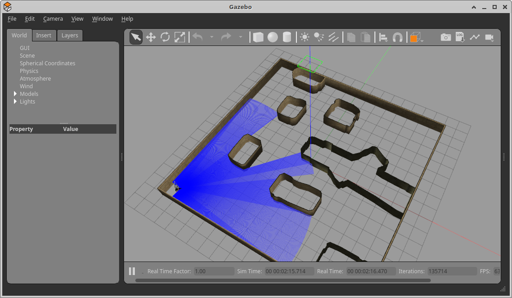
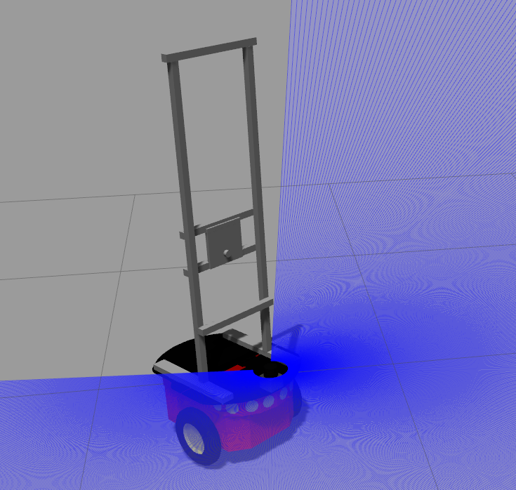
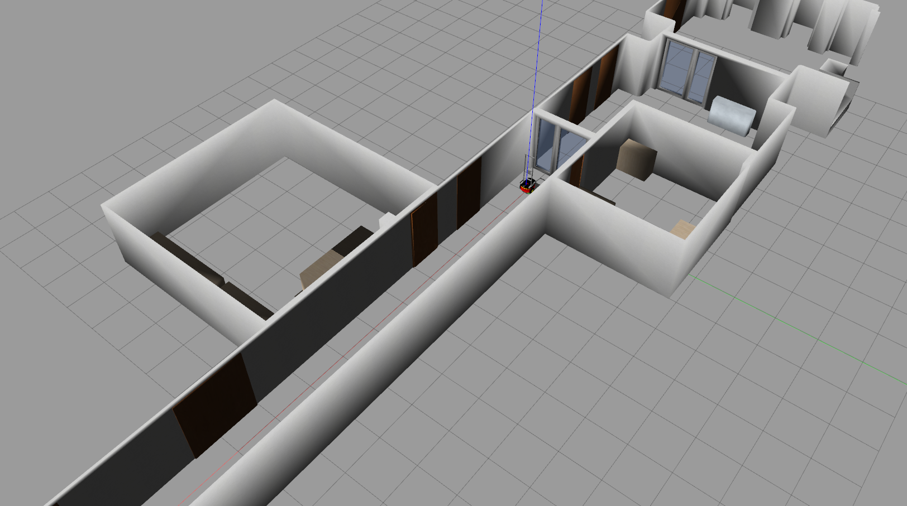

# tuw2_gazebo
gazebo models for ros2

   

## Demo
Lunch World
```
ros2 launch tuw_gazebo world.launch.py room:=cave
```
Spawn a robot
```
ros2 launch tuw_gazebo_models spawn_robot.launch.py robot:=pioneer3dx X:=-6.0 Y:=-6.0 Theta:=0.7
```
Wanderer
```
ros2 run tuw_gazebo_wanderer wanderer_v0.py --ros-args --remap cmd:=/r0/cmd_vel --remap scan:=/r0/scan_raw
```
Useful ROS2 service calls to gazebo
```
# delete a Entry/Model
ros2 service call /get_model_list 'gazebo_msgs/DeleteEntity' '{name: "pioneer3dx"}'
# list Models
ros2 service call /get_model_list 'gazebo_msgs/srv/GetModelList' 
# reset simulation
ros2 service call /reset_simulation 'std_srvs/srv/Empty'
```
## IDE
IDE configuartion are avliable in [ide](ide)

## Install missing dependencies
`rosdep install -i --from-path src --rosdistro galactic -y`
